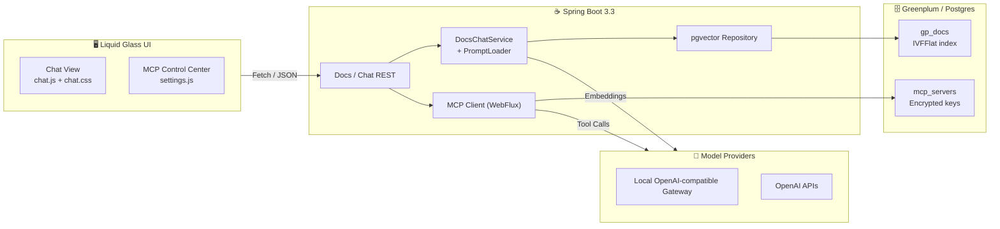

# <div align="center" style="padding:32px 24px;border-radius:28px;background:linear-gradient(135deg,#0d0f1b,#1b1f33);border:1px solid rgba(94,207,255,0.35);box-shadow:0 25px 65px rgba(5,12,32,0.55);">🪄 <span style="color:#6bf2d8;">Greenplum AI Assistant</span> </div>

<div align="center">
  <p style="margin:16px 0 0;font-size:18px;font-weight:500;color:#eaf6ff;">
    Spring Boot · Spring AI · pgvector · MCP tooling · Liquid-glass chat workspace
  </p>
</div>

<p align="center">
  
  
  
  
  
</p>

---

## 🧭 Table of Contents

1. [Why It Shines](#-why-it-shines)
2. [Architecture Snapshot](#-architecture-snapshot)
3. [Front-End Experience Deep Dive](#-front-end-experience-deep-dive)
4. [Back-End & AI Brain](#-back-end--ai-brain)
5. [Run It Now](#-run-it-now)
6. [Configuration Cheatsheet](#-configuration-cheatsheet)
7. [API Quick Reference](#-api-quick-reference)
8. [RAG & Data Flow](#-rag--data-flow)
9. [Observability & Ops](#-observability--ops)
10. [Security Checklist](#-security-checklist)
11. [Development Workflow](#-development-workflow)
12. [License & Credits](#-license--credits)

---

## ✨ Why It Shines

- **🧠 Greenplum-native RAG** — Tailored prompt templates, doc indexing, and version-aware context keep answers aligned with GPDB’s release cadence.
- **🌌 Aurora Chat Surface** — Animated, glassmorphism UI with live model telemetry for an immersive assistant experience.
- **🧩 Model Context Protocol** — Plug in new tools over HTTP SSE; the UI includes a control center for configuring MCP servers on the fly.
- **📡 Version Telemetry** — Auto-detects connected Greenplum/Postgres versions and threads that information into every conversation.
- **📊 Production Friendly** — Flyway migrations, Micrometer metrics, Prometheus endpoint, and resilient HTTP clients are all baked in.
- **🔐 Zero-leak Secrets** — API keys and encryption material are vaulted behind environment variables and AES-256-GCM (see `EncryptionService`).

---

## 🧱 Architecture Snapshot



---

## 🎨 Front-End Experience Deep Dive

The chat surface lives in `src/main/resources/static/` and is intentionally framework-free for speed and control.

### UI Stack at a Glance

| Layer | Significant Libraries / APIs | What They Bring |
|-------|------------------------------|------------------|
| `chat.css` | CSS custom properties, `@keyframes`, backdrop-filter, CSS grid/flexbox | Aurora gradients, glassmorphism panels, responsive layout, glowing status chips. |
| `chat.js` | Vanilla JS, `fetch`, `localStorage`, HTML template cloning, dynamic Markdown renderer | Streaming-style chat bubbles, conversation persistence, JSON-to-table rendering, live config badges. |
| `settings.js` | Fetch API, async/await, DOM diffing, optimistic UI updates | MCP server dashboard (add/edit/delete/test), API key visibility toggle, animated modals. |
| HTML (`index.html`) | Semantic layout, SVG/emoji iconography, template slots | Accessible structure, quick templating for message cards and sidebars. |

### Notable UX Details

- **Liquid Glass Palette** — CSS variables define neon cyan, violet, and teal accents; `backdrop-filter` delivers frosted glass panels.
- **Markdown-with-tables Renderer** — `renderMarkdown` in `chat.js` parses fenced code, inline code, and auto-transforms JSON arrays into data tables.
- **Conversation Memory** — Local storage retains a durable `conversationId`, keeping Spring AI’s memory threads intact across reloads.
- **Telemetry Pill** — Real-time label shows whether you are in local mode or OpenAI mode along with the resolved base URLs.
- **MCP Control Center** — Settings modal lists tool servers with health indicators, last-tested timestamps, activation toggles, and encrypted-key handling.
- **Accessibility Hooks** — Focus rings, keyboard shortcuts (`Enter` vs `Shift+Enter`), and reduced motion fallbacks keep the UI usable beyond the visuals.

---

## 🧠 Back-End & AI Brain

- **Spring Boot 3.3.6 + Java 21** — Modern baseline with virtual-thread friendly configuration and native record support.
- **Spring AI 1.1.0-SNAPSHOT** — ChatClient + Advisor pipeline with prompt templates in `src/main/resources/prompts/`.
- **pgvector** — IVFFlat indexing (`V2__create_mcp_servers_table.sql` and `gp_docs` schema) enables fast semantic search.
- **MCP Integration** — `DynamicMcpClientManager` + `AuthorizingHttpClient` manage per-server encryption and HTTP SSE tool streams.
- **Docs Chat Orchestration** — `DocsChatService` wraps retrieval, prompt assembly, and answer formatting.
- **Resilience** — `ResilientMcpToolCallbackConfig` uses resilience4j-like backoff to keep tool calls stable under failure.

---

## 🚀 Run It Now

> Requires Java 21+, a database with `pgvector`, and optionally an OpenAI-compatible endpoint.

```bash
# 1. (Optional) Capture secrets in .env
cp .env.template .env

# 2. Fire it up
./run.sh -c         # clean build + run (or run.bat on Windows)

# Subsequent runs
./run.sh

# Want OpenAI? Export a key first
export OPENAI_API_KEY=sk-your-key
./run.sh
```

Visit `http://localhost:8080` for the chat UI or `http://localhost:8080/admin/ingest` to load docs manually.

---

## ⚙️ Configuration Cheatsheet

> Every setting is available through `application.yaml` or environment variables.

| Category | Variable | Default | Purpose |
|----------|----------|---------|---------|
| Database | `DB_URL` | `jdbc:postgresql://localhost:15432/gp_assistant` | Target Greenplum/Postgres connection. |
|          | `DB_USERNAME` / `DB_PASSWORD` | `gpadmin` / `VMware1!` | Override in production. |
| AI Models | `LOCAL_MODEL_BASE_URL` | `http://127.0.0.1:1234` | Local OpenAI-compatible gateway. |
|          | `OPENAI_API_KEY` | _(unset)_ | Switches to OpenAI cloud mode automatically. |
|          | `OPENAI_CHAT_MODEL` | `gpt-4o-mini` | Override chat model ID. |
|          | `OPENAI_EMBEDDING_MODEL` | `text-embedding-3-small` | Embedder override. |
| RAG | `DOCS_INGEST_ON_STARTUP` | `true` | Auto ingest documentation on boot. |
|     | `APP_VECTORSTORE_DIMENSIONS` | `1536` | pgvector dimension match. |
| Security | `APP_SECURITY_ENCRYPTION_KEY` | _(required for MCP UI)_ | 32-byte base64 key for AES-256-GCM. |
| Logging | `APP_LOG_FILE` | _(unset)_ | Mirror logs to a file path. |
| MCP | `GP_MCP_SERVER_API_KEY` | _(unset)_ | Default bearer passed to `gp-schema` server. |

Need more? Check `src/main/resources/application.yaml` for the authoritative source.

---

## 📡 API Quick Reference

| Method & Path | Description |
|---------------|-------------|
| `POST /api/ask` | Lightweight text Q&A endpoint (returns a single answer string). |
| `POST /api/chat/message` | Rich chat endpoint backing the UI; returns message, model telemetry, timestamps. |
| `GET /api/chat/config` | Fetch active mode, base URLs, and seeds a conversation ID. |
| `POST /admin/ingest` | Trigger documentation ingestion run. |
| `GET /admin/database-info` | Fetch connection metadata (product, version). |
| `GET /api/status` | Live health info (used for sidebar indicators). |
| `GET /api/mcp/servers` et al. | CRUD for MCP servers (see `settings.js` for the exact routes). |
| `GET /actuator/*` | Spring Boot actuator endpoints (`health`, `metrics`, `prometheus`). |

Quick test:

```bash
curl -s http://localhost:8080/api/chat/config | jq
curl -s -X POST http://localhost:8080/api/ask \
  -H "Content-Type: application/json" \
  -d '{"question":"What is GPDB?", "conversationId":"docs-demo"}'
```

---

## 🔁 RAG & Data Flow

1. **Ingest** — `DocsIngestor` pulls the official PDF (`app.docs.pdf-url`), chunks via `TokenTextSplitter`, generates embeddings, and stores them in `gp_docs`.
2. **Retrieve** — `DocsChatService` performs vector similarity with `top-k` + `similarity-threshold` gates.
3. **Prompt** — `PromptLoader` injects context (connected version, baselines, schema hints) into `gp_system.txt`.
4. **Respond** — Spring AI ChatClient coordinates with either your local gateway or OpenAI. Responses feed the UI markdown renderer.
5. **Tool Call (optional)** — When MCP is enabled, the assistant can call configured tools for live database metadata before answering.

Performance tips:
- Adjust ANN `lists` in `V2__create_mcp_servers_table.sql` when scaling past 100k chunks.
- Consider disabling the index during bulk ingestion, then re-creating.
- Run `ANALYZE gp_docs` after large ingest batches.

---

## 📈 Observability & Ops

- Prometheus scrape: `GET /actuator/prometheus`
- Interesting custom metrics: `gp_assistant.docs.ingest.*`, `gp_assistant.chat.*`, `gp_assistant.api.ask`.
- Structured logging: console JSON optional via `APP_LOG_FILE`.
- Health dashboard: `GET /actuator/health` (UI sidebar consumes `/api/status` for richer detail).
- MCP diagnostics: `GET /api/mcp/servers/{id}/logs` (see controller) to trace tool interactions.

---

## 🔐 Security Checklist

- 🔑 Provide `APP_SECURITY_ENCRYPTION_KEY` before enabling the MCP settings UI — encrypted API keys never touch disk in plain text.
- 🧱 Deploy behind TLS (reverse proxy or Spring Boot native SSL) — sample config assumes HTTPS in production.
- 🧾 Externalize secrets (`.env`, Vault, Kubernetes secrets) and never commit `.env` files.
- 🛡️ Add authentication (Spring Security / OAuth) before exposing endpoints outside a trusted network.
- 🕵️ Enable database least privilege: ingestion user needs `CREATE EXTENSION` and CRUD on `gp_docs`, nothing more.

---

## 🛠️ Development Workflow

```bash
# Format & lint (coming soon)
./mvnw spotless:apply

# Run unit tests
./mvnw test

# Run only the RAG integration test
./mvnw -Dtest=RagQueryTest test
```

Recommended enhancements:
- Add GitHub Actions workflow mirroring the above steps.
- Containerize with Docker Compose (Greenplum, vector-enabled Postgres, assistant app).
- Introduce streaming chat responses using Server-Sent Events for incremental token updates.

---

## 📜 License & Credits

Licensed under the [Apache License 2.0](LICENSE).

Huge thanks to:
- [Spring AI](https://docs.spring.io/spring-ai/reference/) for the prompt orchestration tooling.
- [Greenplum Database](https://greenplum.org/) for the MPP engine.
- [pgvector](https://github.com/pgvector/pgvector) for fast semantic search.
- [OpenAI](https://openai.com/) and the growing ecosystem of OpenAI-compatible gateways.

<p align="center" style="font-size:14px;color:#8f9fff;margin-top:32px;">
Crafted with 💚 for data engineers who live in Greenplum.
</p>
